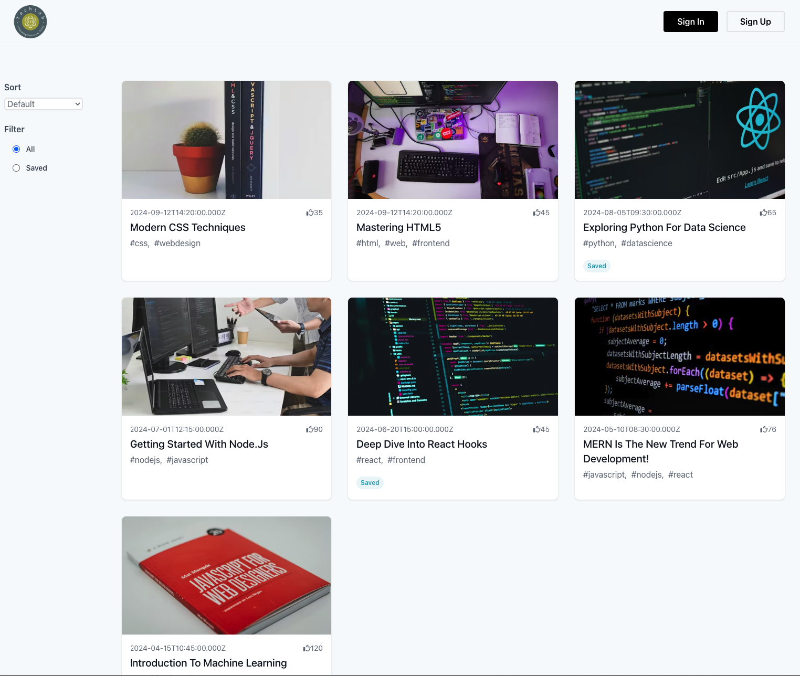
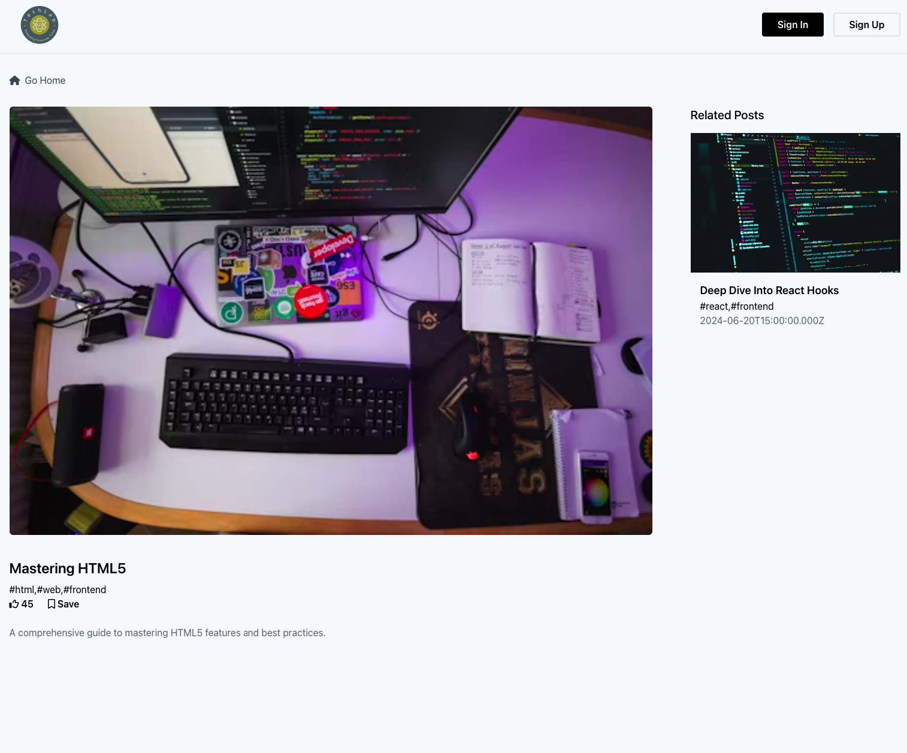

## Techlab | BLOG with Redux Toolkit

### Overview

Techlab Blog is a web application built using React and Redux Toolkit for state
management, hosted on Railway. It offers a collection of blog posts fetched from
a JSON server. The backend is powered by PostgreSQL and Prisma for data
management. Users can view blog posts, like them, save their favorite posts, and
explore related content based on tags.

### Features

- **Redux Toolkit**: Utilized for efficient state management, handling actions
  like liking posts, saving posts, and managing related blog data.
- **Blog Posts**: Displayed in a grid layout on the home page, showcasing title,
  thumbnail, description, likes, and tags.
- **Sorting**: Users can sort posts by "Newest" and "Most Liked" from the menu
  to view relevant content.
- **Likes**: Users can like blog posts, and the likes are synced with the
  server.
- **Saved Posts**: Users can view saved posts by clicking on the "Saved" menu
  item.
- **Blog Details**: Clicking on a blog post title or thumbnail navigates users
  to the details page using 'react-router-dom'.
- **Save/Unsave**: On the details page, users can save or unsave posts,
  indicated by the "Saved" button with an active color when saved.
- **Related Blogs**: The details page includes a section of related blogs based
  on tags, excluding the current post.
- **Database**: PostgreSQL database with Prisma used for efficient data
  management.

### Technologies Used

- **Frontend**:

     - React
     - Redux Toolkit
     - React Router DOM

- **Backend**:

     - PostgreSQL
     - Prisma

- **Deployment**:
     - Railway for backend
     - Vercel for frontend

## Live Demo

Explore the live demo of the project
[here](https://book-store-app-brown.vercel.app/).

